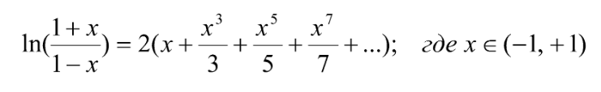

# Semester-1
Laboratory works from my first semestr
## Лабораторная  работа 1

### Общее задание:
1. Вычисление факториала натурального числа.  
2. Нахождение НОД и НОК двух натуральных чисел.  
3. Сумма цифр целого числа (с учётом отрицательных чисел).  
4. Решение квадратного уравнения (все случаи, включая нулевые коэффициенты).  
5. Вывод трапеции из символов '*' (заданный размер верхней стороны и количество строк).  
6. Проверка числа на палиндром (с учётом отрицательных чисел).  
7. Возведение числа в степень (любую, включая дробную) с проверкой корректности ввода.  
8. Проверка натурального числа на простоту.

### Дополнительные задания:  
9. Проверка, равно ли число произведению своих уникальных простых делителей (с их выводом).  
10. Подсчёт количества различных цифр в числе.  
11. Нахождение всех простых делителей числа.  
12. Построение ёлочки из равносторонних треугольников (с возрастающей высотой).

## Лабораторная  работа 2

### Общее задание:
1. Функция представлена в виде своего ряда Тейлора. Вычислить приближённое значение суммы этого бесконечного ряда. Вычисления заканчивать, когда очередное слагаемое окажется по модулю меньше заданного числа ε. Вид этого числа определяется следующим условием: ε = 10-k , где k – натуральное число. 
2. Значения x и k ввести с клавиатуры. 
3. Факториал и степень в слагаемых отдельно не считать! 
4. Сравнить полученный результат со значением, вычисленным через стандартные функции.

## Лабораторная  работа 3
## Лабораторная  работа 4
## Лабораторная  работа 5
## Лабораторная  работа 6
## Лабораторная  работа 7
## Лабораторная  работа 8
## Лабораторная  работа 9
## Лабораторная  работа 10

